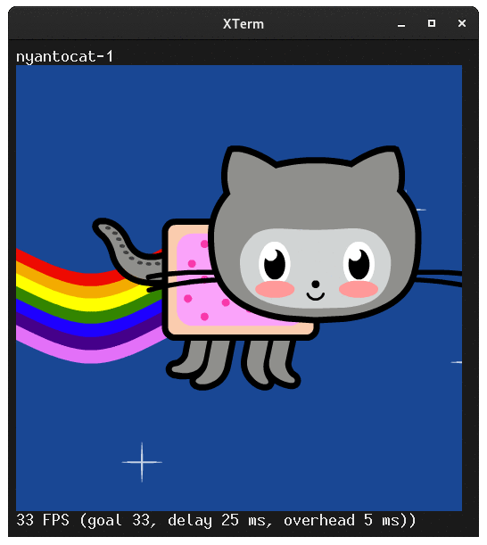

# sixvid



Simple script for animated GIF viewing using sixels

## What is sixvid?

Sixvid is a looping GIF viewer for sixel terminals written in bash. It
was something hackerb9 wrote a long time ago and may never be properly
finished. It does have some nice features, though.

## Install

Download [sixvid](https://github.com/hackerb9/sixvid/raw/main/sixvid) to a
directory in your PATH (e.g., ~/bin or /usr/local/bin) and make it
executable (chmod +x sixvid). 

## Usage

**sixvid** [ *-e* | *-s* | *-S* ]  [ *-b* ] &lt;filename>

```bash
$ sixvid nyantocat.gif
```

### Keys

| Key | Action |
|:-:|:-:|
| Space | Quit |
| p | Pause |
| [, ] | Slower, faster FPS |
| Backspace | Reset FPS |

Other keys
| Key | Action |
|:-:|:-:|
| b | Benchmarking (draw as fast as possible) |
| ^L | Redraw screen <br/>(in case of scrolling glitches)|
| M | use mimeopen to launch external viewer |
| q, Esc | Quit, but with different return code<br/>(for wrapper scripts) |


### Command line options

| Short | Long | Meaning |
|:-|:-|:-|
| -e | --no-shrink | Show image exactly, no color/geometry reduction regardless of ssh or serial connection<br/>(alias --exact) |
| -s | --shrink | Force shrinking color/geometry<br/>(pretend to be over ssh)<br/>(alias --ssh) |
| -S | --serial | Force shrinking color/geometry<br/>(pretend to be over a serial connection) |
| -b | --benchmark | Run as fast as possible, setting goal FPS to infinity |


## Niceties

* Can be used as a rough benchmark of relative sixel performance for
  various terminal emulators on the same machine. (See
  [**Benchmarking**](#benchmarking-with-sixvids-fps) below)

* Decodes video and converts to sixel in background processes.

* Shows status of background jobs and loops on as much video as has
  been decoded so far.

* Dynamically adjusts delay loop to approximate correct FPS.

* Attempts to shrinks geometry/color depth when on slow ssh/serial connection.

* Exiting program when benchmarking shows average FPS, starting from
  time when background processes (decoding, sixelizing) finished.

* Not limited to GIF. Can handle any video format that `ffmpeg` can read.

## Requirements

* A sixel capable terminal (e.g., `xterm -ti vt340`)

* ImageMagick

* ffmpeg

## Benchmarking with sixvid's FPS

You can use `sixvid` to give you a rough idea of how fast terminal
emulators interpret sixels on your machine. Hit the letter `b` while
viewing (or use the `-b` flag) to turn on benchmarking mode, which
attempts to send the frames as fast as possible.

Because the FPS number depends greatly on your own machine, it is not
a pure measurement of a terminal emulator's speed. You cannot compare
numbers for different terminal emulator if they were calculated on
different machines.

With that caveat, the sixvid FPS numbers are good enough to at least
give you a sense of relative speed of terminal emulators.

As of September 2021, here are the speeds on hackerb9's box using the
[media/nyantocat.gif](nyantocat.gif) image.

```bash
sixvid --benchmark nyantocat.gif
```

|Terminal|Frames per Second|Notes|
|:-:|:-:|:-|
|[contour](https://github.com/contour-terminal/contour/) 0.2.0.173++<br/>(git 2021-09-12) | 133 FPS|Compiled with debugger support enabled as it is not yet stable|
|[foot](https://codeberg.org/dnkl/foot) 1.6.4 | 169 FPS|Debian 11 (Bullseye) package|
|[mlterm](https://sourceforge.net/projects/mlterm/) 3.9.0 | 240 FPS|Debian 11 (Bullseye) package|
|[XTerm](https://invisible-island.net/xterm/)(366) | 223 FPS|Debian 11 (Bullseye) package|
|[yaft](http://uobikiemukot.github.io/yaft/) 0.28++<br/>(git 2018-11-14) | 230 FPS|Linux framebuffer version|

## Todo

* Utilize transparent GIF techniques to optimize sixel output.

* Send a single frame to get an initial "weightestimate" instead of
  hardcoding it. 

* Benchmark should show std deviation of FPS since some some terminals seem especially
  inconsistent in their speed.

* Detect and utilize VT340 double-buffering via Page Memory.

* Either crop/scale large images or go back to using DECSDM to prevent scrolling.

* Catch SIGWINCH and resize the image appropriately.

## Limitations

* Takes an exorbitant amount of `/tmp` space as it unpacks every frame
  first as PPM and then as sixels. For example, [this 4 MB clip from
  Blender's _Spring_](media/spring.webm) expands to over 4 **G**B in
  /tmp during conversion. (It drops back to "only" 1 GB once it
  finishes converting the PPM files to sixel.)

  Using PNG and gzipping the sixels may help, at the cost of CPU, but
  there is no obvious solution to this problem. Ideally, `ffmpeg` would
  have direct sixel output. 

* Does not attempt to play audio. This is unlikely to happen until
  machines are so fast it's easy for a shell script to write 44,100
  16-bit stereo samples per second to an audio device.

* Large videos on slow CPUs might not finish rendering to sixel before
  the animation loops back to the start. The most obvious alternative,
  stuttering along as the CPU decodes each frame, is boring to watch.
  The second most obvious alternative, waiting until the entire video
  is decoded, is a non-starter as the video may be very long and the
  user might only need to see the first few seconds before they want
  to quit.

## Bugs, bugs, bugs

* If the first guess of `weightestimate` — milliseconds to transfer and
  display a single sixel frame — is far off the mark, then it can take
  a few seconds for the animation to play at the correct FPS.

* For large videos, sixvid should probably render to 1-bit sixel as quickly
  as possible and then replace it with higher depth once all the
  frames are done.

* Eventually should use DECSDM (sixel display mode) so that large
  images don't cause scrolling, but we're in the awkward, teenage
  years of understanding DECSDM. (Viz.: dankamongmen's ["DECSDM is a
  poorly-understood
  hellscape"](https://github.com/dankamongmen/notcurses/issues/1782)).

* Sixvid uses the number of sixel bytes being sent to guess if it
  should downscale/grayscale the image to maintain the framerate.
  However, network bandwidth isn't the only bottleneck. Some terminals
  may be slower at rendering a large image than one with more colors,
  given the same filesize.


